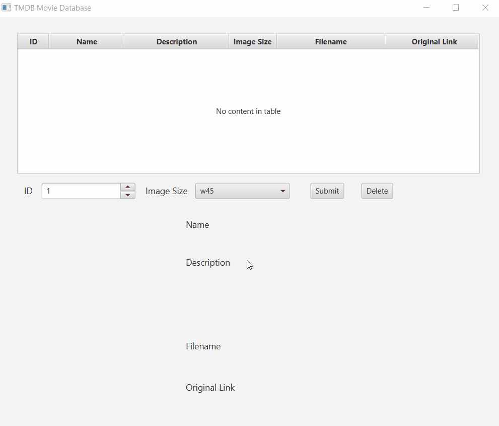
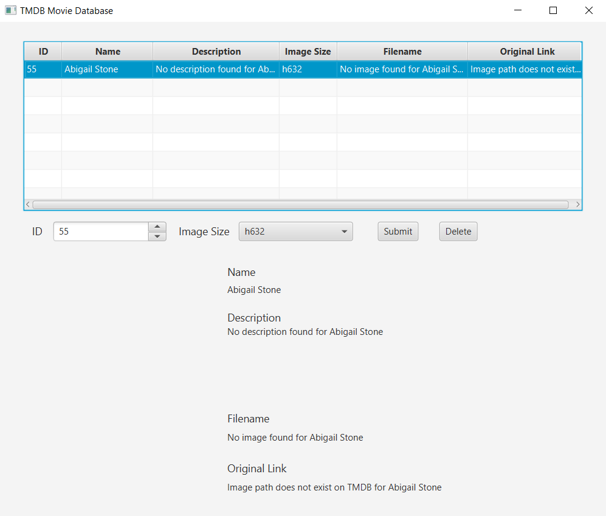
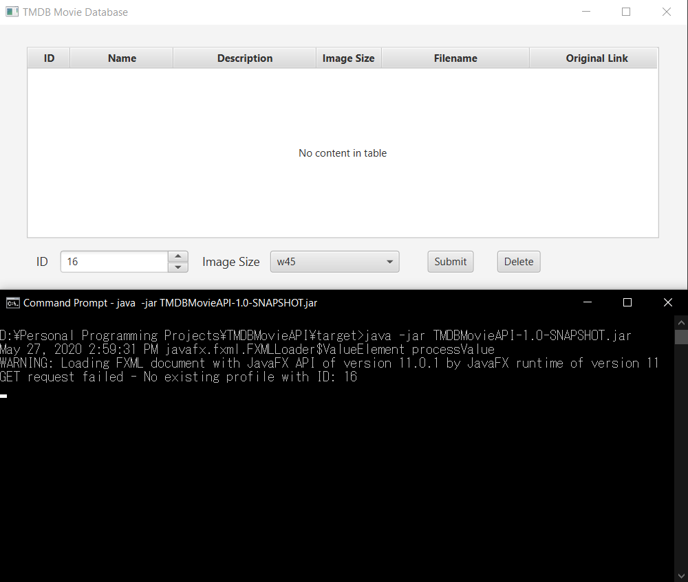
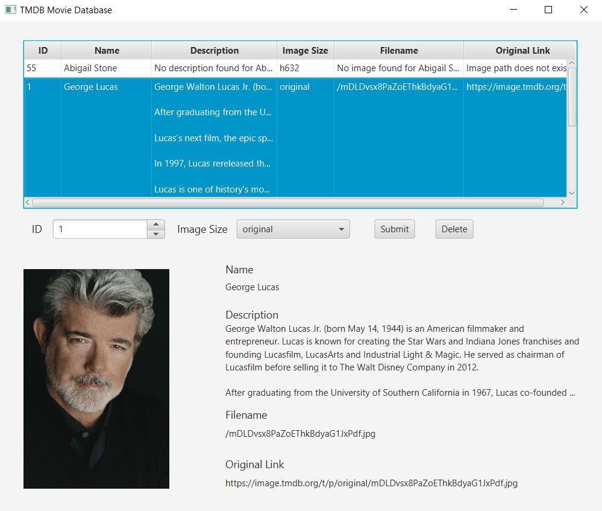
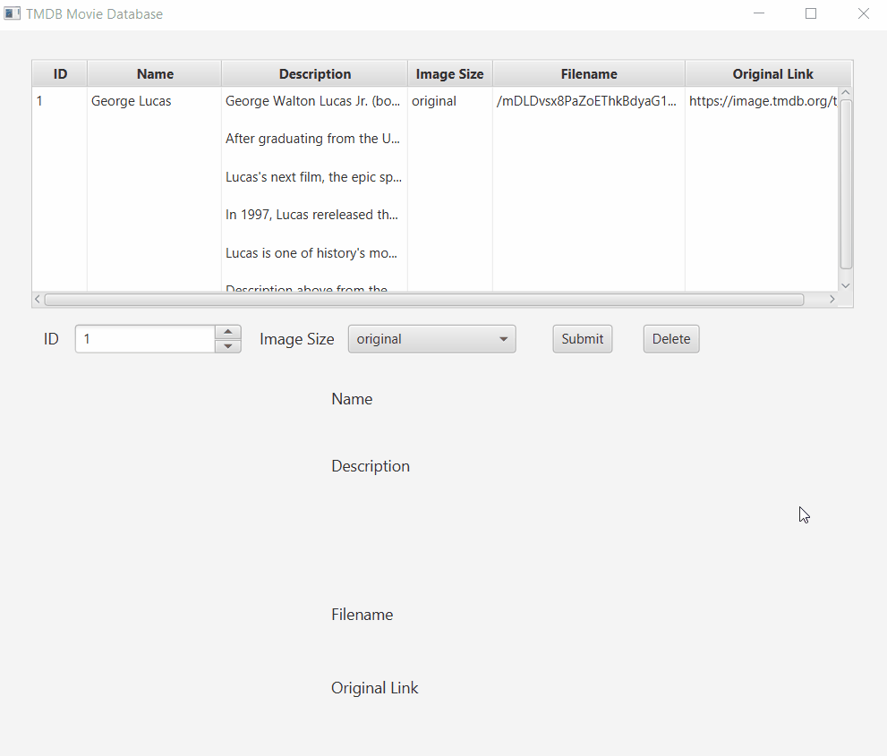

# TMDBMovieAPI
 Java project which retrieves and saves photos from The Movie DB's API. The photos are then able to be viewed by the user. Coded as part of an assignment.

## Contact Info
Julian Chong Zhan Feng (julianchong00@outlook.com)

## Getting Started
### Prerequisites
This application requires a Java 1.8 (or higher) JDK to run the jar file. If `java` command is not supported on your computer, download Java from [here](https://www.oracle.com/java/technologies/javase-downloads.html).

### Maven Setup
Go to the file path directory.

    cd /{PATH}/TMDBMovieAPI

Install all relevant dependencies for the application to run.

    mvn clean install

If `mvn` command is not supported on your computer, follow the steps [here](https://www.baeldung.com/install-maven-on-windows-linux-mac) to install Maven.

### Running the Application
Navigate to target folder within file path directory.

    cd /{PATH}/TMDBMovieAPI/target

Then open Command Prompt and run the following command.

    java -jar TMDBMovieAPI-1.0-SNAPSHOT.jar

## Application Use Case
#### The design requirements for this application were the following:

- Use developer API from [The Movie DB](https://www.themoviedb.org/documentation/api) to retrieve photos and save those photos in your server. You could retrieve any photo you like.
- Keep the title, description, filename and its original link on The Movie DB of each photo in any data format chosen.
- Handle the json query request from a user to query photo name, description, filename and its orginal link from your data storage.

### Introduction
This application was built using **JavaFX**, which is an open source client application platform for desktop, mobile and embedded systems built on Java. I chose to use a **H2 database** to store the data retrieved from the Movie API database (TMDB) as it is a lightweight Java database and it supports **JDBC** API.

### Retrieving and Saving Photos
Users are able to retrieve photos from TMDB via an API call which has two **required** fields: *id* (as a query parameter), and *imagesize* to retrieve the correct image link. Upon retrieval, all data is then saved locally into a **H2 database**.

#### Supported Field Values:
- *id* - integers only (1 to Integer.MAX_VALUE)
- *imagesize* - {"w45", "w185", "h632", "original"}

#### Example (Success)
Input an *id* number into the spinner and choose an *imagesize* for the image. Then click the **Submit** button to GET a response from TMDB, containing an actor's name, description, filename, and original link. The retrieved profile is then added as a row to the table view.

#### Example (Failure - No Image)
In the case of the TMDB failing to respond with an image. The profile will be stored as shown below.

#### Example (Failure - No Profile with ID Given)
However, if the TMDB fails to even return a response code of 200, an error message will be written to the console.

### Querying the Database and Viewing the Image
Since the retrieved data are stored on a local database, a simple SQL query can be made to retrieve a profile and its details. As a row is selected, the profile details and the image associated with it are shown below the table.

## Additional Functionality

### Deleting Profiles
Users can delete profiles which have been retrieved from TMDB and stored in the local database by selecting the profile which they wish to delete and clicking on the **Delete** button.

## Bulit With
- [JavaFX](https://openjfx.io/) - Platform to build client application
- [Maven](https://maven.apache.org/) - Dependency management
- [H2 Database Engine](https://www.h2database.com/html/main.html) - Used to store profiles locally